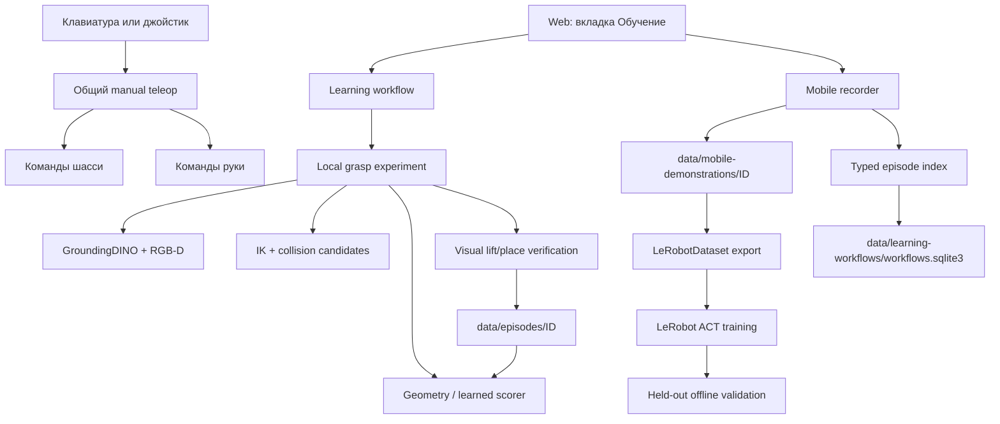

# Как устроено обучение Explorer

> Обновление 8 октября 2026: актуальный пользовательский путь описан в
> [TRAINING-GUIDE.ru.md](TRAINING-GUIDE.ru.md). На странице «Обучение» теперь
> действует один поток: навык → полный ручной показ → оценка результата →
> автоматическая очередь LeRobot ACT на Explorer → отдельная наблюдаемая
> проверка кандидата. Код: `skill_learning.py`, `mobile_demonstrations.py`,
> `lerobot_bridge.py`, `learning-run.py`, `mobile_policy_contract.py`,
> `mobile_policy_execution.py`. Ниже сохранено описание прежнего интерфейса
> для разбора старых эпизодов; его кнопки скрыты в текущем UI.

Этот документ описывает фактическую реализацию вкладки **«Обучение»** на текущем Explorer. Он показывает путь от нажатия кнопки до файлов на Jetson, формирования набора LeRobot, обучения ACT и доступного физического эксперимента.

## 1. Что именно сейчас называется обучением

В проекте есть два независимых обучающих контура.

| Контур | Назначение | Текущее состояние |
|---|---|---|
| Mobile LeRobot ACT | Учиться по человеческим демонстрациям совместным командам руки и шасси | Запись, экспорт, обучение и offline-проверка реализованы. Автоматическое физическое исполнение 9-DoF mobile ACT пока не подключено |
| Local grasp scorer | Самостоятельно выбирать один из геометрически допустимых вариантов локального захвата | Физический цикл, визуальная проверка, накопление результатов, обучение scorer и контролируемое продвижение кандидата реализованы |

Они используют общую сущность **workflow**, но обучают разные вещи:

- ACT аппроксимирует действия оператора по изображению и текущему вектору команд;
- grasp scorer ранжирует уже построенные геометрические варианты захвата по контексту и накопленным исходам.

Базовый YOLO не обучается кнопками этой страницы. Во время демонстрации он показывает объекты из словаря COCO. Для запроса `sock` используется отдельный локальный GroundingDINO, когда запускается автономный локальный захват.

## 2. Общая схема



Никакие данные автоматически не загружаются в облако. Hugging Face работает в offline-режиме, `push_to_hub=false`, Weights & Biases отключён.

## 3. Кнопки выбора режима обучения

### «Я покажу»

**Frontend:** `chooseLearningMode('HUMAN_DEMONSTRATION')`.

Кнопка только выбирает режим и выставляет:

- ручные показы: 5 по умолчанию;
- самостоятельные попытки: 0.

При создании серии backend записывает `mode=HUMAN_DEMONSTRATION`. Даже если пользователь ввёл самостоятельные попытки, backend принудительно делает их равными нулю.

После каждого завершённого показа manifest импортируется в единое хранилище эпизодов. Когда число показов достигает цели, workflow автоматически пытается запустить mobile ACT на 1000 шагах. Если обучение успешно завершилось, серия становится `complete`.

**Статус:** реализовано для записи и offline ACT.

### «Пусть пробует сам»

**Frontend:** `chooseLearningMode('AUTONOMOUS')`.

Выставляет:

- ручные показы: 0;
- самостоятельные попытки: 50.

После нажатия запуска серии frontend сразу вызывает `startWorkflowAutonomy()`. Он выдаёт временное разрешение `arm_motion + target_contact` на один час для указанного объекта и просит backend запустить физический эксперимент.

Физический backend — `LocalGraspExperiment`. Он принимает только:

- `skill=grasp`;
- состояние `queued_autonomous` или `interrupted`;
- неподвижную базу с включённым STOP;
- доступную руку, принятую hand-eye-калибровку и разрешённый экспериментальный профиль захвата.

Если выбран **«Полный поиск → перевозка → размещение»**, этот backend откажет: автономный mobile ACT executor ещё не подключён.

**Статус:** реализовано для локального `grasp`; отсутствует для полной мобильной доставки.

### «Учиться вместе»

**Frontend:** `chooseLearningMode('HUMAN_INTERVENTION')`.

Планирует самостоятельные попытки, в которых действия человека должны сохраняться как `HUMAN_INTERVENTION`. Backend умеет записывать:

- исходное предложенное действие;
- действие, выполненное человеком;
- время начала и окончания вмешательства;
- признак, что прежнее автономное действие аннулировано;
- требование получить новый кадр и перепланировать действие.

API: `POST /api/learning/workflows/{id}/intervention`.

После вмешательства workflow переходит в `reobserve_and_replan`; продолжать старое решение запрещено.

Текущая web-панель не вызывает этот endpoint автоматически при перехвате джойстиком. Обычный ручной takeover останавливает автономный эксперимент, но ещё не формирует полноценную запись intervention.

**Статус:** backend и формат данных реализованы; автоматическая привязка web/gamepad takeover — частичная.

### «Сначала покажу, дальше сам»

**Frontend:** `chooseLearningMode('BOOTSTRAP_THEN_AUTONOMOUS')`.

Серия сначала находится в `waiting_demo`. После достижения `human_target`:

1. выбираются пригодные показы;
2. запускается mobile ACT на 1000 шагах;
3. workflow следит за `job.json`;
4. после `validated_offline` или `trained_unvalidated` переходит в `queued_autonomous`;
5. пользователь может нажать **«Продолжить самостоятельно»**.

Для `skill=grasp` самостоятельная часть использует `LocalGraspExperiment`, а не ACT. Для `mobile_pick_place` модель ACT обучается, но физический mobile executor отсутствует, поэтому полная самостоятельная поездка этим режимом пока не выполняется.

**Статус:** bootstrap и обучение реализованы; самостоятельный local grasp реализован; mobile ACT execution отсутствует.

## 4. Поля серии

### «Мои показы»

Число от 0 до 500. Сохраняется как `human_target`. Каждый законченный эпизод, связанный с workflow, увеличивает `human_done`, включая честные `failure` и `unknown`. Счётчики `success`, `failure`, `unknown_count` ведутся отдельно.

### «Самостоятельные попытки»

Число от 0 до 500. Сохраняется как `autonomous_target`. После каждой завершённой попытки увеличивается `autonomous_done`.

### «Захват предмета»

Создаёт `skill=grasp`.

Для ручного успешного эпизода обязательна только стадия `grasp`. Для автономии доступен локальный physical loop. База остаётся неподвижной под STOP.

### «Полный поиск → перевозка → размещение»

Создаёт `skill=mobile_pick_place`.

Успешная демонстрация требует четыре стадии:

1. `travel_to_object`;
2. `grasp`;
3. `carry`;
4. `place`.

Этот формат предназначен для 9-мерного mobile ACT: шесть команд руки плюс `vx`, `vy`, `wz` шасси.

### Поле предмета

Сохраняется как `target`. Для локального GroundingDINO используйте английское имя `sock`, `bottle`, `backpack` и т. п. Некоторые русские слова переводятся встроенной таблицей aliases.

### «Я вижу робота…»

Это явное подтверждение оператора, а не результат компьютерного зрения. Без него запись и физический эксперимент не запускаются. Флажок также синхронизируется с подтверждением на странице ручного управления.

## 5. Кнопки запуска серии

### «Подготовить: носок → корзина»

Это frontend-пресет. Он не запускает движение и не создаёт файлы. Он выставляет:

- `HUMAN_DEMONSTRATION`;
- 50 ручных показов;
- 0 самостоятельных попыток;
- `skill=mobile_pick_place`;
- `target=sock`;
- цель `Собрать носок в корзину`.

### «НАЧАТЬ СЕРИЮ И ПЕРВЫЙ ПОКАЗ»

Последовательность вызовов:

1. `POST /api/learning/workflows`;
2. `LearningWorkflows.start(...)` создаёт UUID серии;
3. строка записывается в `data/learning-workflows/workflows.sqlite3`;
4. если `human_target > 0`, состояние становится `waiting_demo`;
5. frontend немедленно вызывает `POST /api/learning/workflows/{id}/demonstration`;
6. `MobileDemonstrations.start(...)` создаёт папку эпизода и поток записи.

Если `human_target=0`, frontend пытается сразу запустить автономный local grasp.

### «Начать следующий показ»

Использует существующий `learningWorkflow` и снова вызывает `/demonstration`. Новый UUID создаётся только для эпизода; серия остаётся прежней.

Одновременно может записываться только один mobile episode.

### «Продолжить самостоятельно»

Последовательно:

1. создаёт временное разрешение на движение руки и контакт с выбранным объектом;
2. вызывает `/api/learning/workflows/{id}/autonomous/start`;
3. backend проверяет тип skill, состояние workflow и capability `LEARN_GRASP_LOCAL`;
4. при успехе запускает отдельный поток `LocalGraspExperiment.run()`.

Эта кнопка сейчас предназначена для `skill=grasp`.

## 6. Ручное управление во время показа

### «Клавиатура» и «Джойстик»

Обе кнопки выбирают владельца общего `ManualTeleop`. Запись не создаёт отдельный канал управления: она наблюдает фактические команды уже работающей системы.

Смена источника:

- отсоединяет прежнего владельца;
- очищает удержанные клавиши и остаточные интеграторы;
- требует нейтраль перед возобновлением;
- не начинает движение сама.

### «Разрешить управление»

Для клавиатуры выбирает источник, режим руки и отправляет нейтральный кадр, после чего снимает программный STOP через явный resume. Для джойстика включает panel listener, профиль `TELEOP`, затем выполняет resume.

Запись демонстрации допускается только когда состояние робота имеет `mode=MANUAL`.

### «СТОП»

Вызывает `/api/teleop/stop`. Команды движения обнуляются, активный manual ownership прекращается. STOP не маркирует эпизод как успешный.

### «Записывать одновременную работу шасси и руки»

В текущем интерфейсе совместная запись включена всегда. Флажок оставлен как явное описание формата и синхронизируется с общей настройкой combined. Отдельного режима «записывать только руку, игнорируя базу» для mobile episode сейчас нет.

### Скорость

Точный режим включается:

- `Shift` на клавиатуре;
- `X` на джойстике.

Отклонение аналогового стика пропорционально величине команды. Скорость сохраняется как реально отправленный вектор, а не как название профиля.

## 7. Кнопки записи и разметки

### «Отдельный показ без серии»

Вызывает `POST /api/teaching/mobile/start` без `workflow_id`.

Эпизод сохраняется в `data/mobile-demonstrations`, но не увеличивает счётчики обучающей серии. Он может участвовать в ручном запуске ACT, если:

- имя задачи точно совпадает;
- результат `success`;
- присутствуют обязательные стадии;
- есть не менее 20 синхронных кадров.

### «Прервать»

В текущей реализации вызывает `finishDemo('failure')`. Это завершает запись как `complete/failure`, а не как `cancelled`. Такой эпизод остаётся отрицательным результатом и не попадает в desired imitation dataset ACT.

### Стадии 1–4

Кнопки вызывают `/api/teaching/mobile/stage` и меняют поле `stage`:

| Кнопка | Метка |
|---|---|
| 1 · поиск и ход | `travel_to_object` |
| 2 · захват | `grasp` |
| 3 · перевозка | `carry` |
| 4 · размещение | `place` |

Каждый следующий сохранённый sample получает текущую метку стадии. В `episode.json` также накапливается список всех посещённых стадий.

### «Получилось»

Перед сохранением backend проверяет:

- не менее 20 samples;
- для `mobile_pick_place` посещены все четыре стадии;
- для `grasp` посещена стадия `grasp`.

После этого manifest получает `state=complete`, `outcome=success`, `label_source=operator`. Если эпизод относится к workflow, callback импортирует его в typed episode store и увеличивает счётчики серии.

### «Не получилось»

Сохраняет `outcome=failure`. Эпизод остаётся в истории и счётчиках, но не экспортируется как желаемая ACT-демонстрация.

## 8. Что записывает MobileDemonstrations

Частота — 2 samples/с. Для каждого sample требуются:

- свежий `data/status.json`;
- `mode=MANUAL`;
- питание не `LOW_POWER`, `CRITICAL`, `UNKNOWN` или `CHARGING`;
- валидная история команд руки;
- свежие odometry, battery, scan0 и scan1;
- синхронный RGB-D snapshot;
- допустимое временное расхождение камеры и состояния.

Один sample содержит:

- timestamp камеры и состояния;
- JPEG-кадр;
- шесть текущих команд сервоприводов;
- `vx`, `vy`, `wz`;
- raw odometry pose;
- summary двух лидаров;
- стадию задачи;
- источник ручного управления, arm mode и схему кнопок;
- provenance `commanded_not_measured`.

Краткое рассогласование камеры теперь пережидается до трёх секунд. Во время активной записи perception переходит с idle FPS на active FPS.

Структура папки:

```text
/home/vlad/Explorer/data/mobile-demonstrations/<episode-id>/
├── episode.json
├── samples.jsonl
├── 000000.jpg
├── 000001.jpg
└── ...
```

`episode.json` обновляется атомарной заменой файла. `samples.jsonl` дописывается построчно. Автоматического удаления и cloud upload нет.

## 9. Typed episode store и workflow database

После завершения связанного показа `EpisodeStore.import_legacy()` создаёт индекс:

```text
/home/vlad/Explorer/data/episodes/<derived-id>/episode.json
```

Изображения не копируются: typed manifest содержит хэш и относительную ссылку на исходный `episode.json`.

Workflow хранится в SQLite:

```text
/home/vlad/Explorer/data/learning-workflows/workflows.sqlite3
```

Основные состояния:

- `waiting_demo` — ждёт следующий человеческий показ;
- `training` — ACT job запущен;
- `training_blocked` — обучение не запустилось или завершилось ошибкой;
- `queued_autonomous` — готов к автономной попытке;
- `autonomous` — физическая попытка выполняется;
- `reobserve_and_replan` — после вмешательства нужен новый кадр и план;
- `needs_reset` — оператор должен вернуть предмет;
- `complete`, `failed`, `cancelled`, `interrupted`.

Каждый переход дополнительно записывается в таблицу `events`.

## 10. Кнопка «Обучить выбранный навык»

Frontend вызывает:

```text
POST /api/learning/train-mobile
steps = 5000
task = название в поле задачи
```

Это ручной запуск для пригодных mobile episodes с **точно совпадающим именем задачи**. Автоматический workflow использует каноническое имя `skill + target`, например `mobile_pick_place sock`, и запускает 1000 шагов после достижения `human_target`.

Перед запуском проверяется:

- выбран ресурсный профиль `training`;
- нет другой тяжёлой задачи;
- доступно не менее 1500 МиБ RAM;
- backend LeRobot отмечен `ready`;
- свежая телеметрия питания;
- напряжение не ниже 11,5 В;
- состояние питания `NORMAL` или `IDLE`;
- шасси находится в STOP;
- рука не исполняет команду;
- есть хотя бы один успешный пригодный показ.

Задание сохраняется здесь:

```text
/home/vlad/Explorer/data/learning-jobs/<job-id>/job.json
```

Затем создаётся `data/learning-request.json` и запускается единственный systemd unit `explorer-train.service`. Одновременные GPU training jobs запрещены.

## 11. Экспорт в LeRobot

Для mobile episode создаётся `LeRobotDataset` с FPS=2 и признаками:

```text
observation.state = [J1, J2, J3, J4, J5, gripper, vx, vy, wz]
action            = следующий вектор из девяти значений
observation.images.wrist = RGB 320×240
task              = имя задачи + текущая стадия
```

Текущее состояние берётся из строки `current`, целевое действие — из следующей строки `future`. Поэтому последний sample эпизода не образует отдельную пару.

Проверки экспорта:

- не менее 20 строк;
- shape строго `(9,)`;
- только конечные числа;
- каждый JPEG существует;
- outcome и operator label повторно сверяются непосредственно перед обучением.

Если эпизодов больше одного, примерно 20% целых эпизодов откладывается для validation. Кадры одного эпизода не смешиваются между train и validation.

## 12. ACT

Используется официальный LeRobot ACT:

- `device=cuda`;
- `chunk_size=1`;
- `n_action_steps=1`;
- `dim_model=256`;
- 4 attention heads;
- 2 encoder layers;
- 2 VAE encoder layers;
- batch size 4;
- checkpoints каждые 500 шагов;
- WandB и Hub отключены.

Артефакты job:

```text
learning-jobs/<job-id>/
├── job.json
├── split.json
├── train-config.json
├── train.log
├── train/
├── validation/
├── validation.json
└── model/checkpoints/last/pretrained_model/
```

Offline validation сравнивает предсказание ACT с операторским action и считает:

- mean absolute error;
- p95 absolute error;
- ошибку простого baseline «оставить состояние без изменения»;
- улучшает ли модель hold baseline;
- число независимых held-out эпизодов.

`validated_offline` означает только прохождение offline-проверки. Поле `automatic_execution_allowed` остаётся `false`.

## 13. Самостоятельный локальный захват

`LocalGraspExperiment` выполняет один bounded цикл:

1. **Detect.** GroundingDINO-tiny получает текстовую цель и один свежий RGB-D кадр. Порог box score 0,35, text threshold 0,25.
2. **Depth geometry.** Внутри bbox выделяется foreground и оценивается точка в optical camera frame.
3. **Reacquire and track.** Цель повторно связывается со свежим кадром, создаётся feature tracker, геометрия переводится через принятую hand-eye-калибровку.
4. **Candidates.** Строятся три позиции: центр и боковые смещения ±1 см.
5. **IK/collision.** Для каждого варианта вызываются IK и проверка коллизий. Недостижимые варианты отбрасываются.
6. **Ranking.** Geometry baseline или candidate scorer оценивает доступность, clearance, uncertainty, trajectory cost и контекст объекта. Exploration probability — 0,15.
7. **Approach.** MoveIt-план передаётся текущему trajectory executor; каждое движение повторно проверяет permit и STOP.
8. **Guarded closure.** Захват закрывается ступенями 6°, затем 3°. После каждой ступени анализируются свежие визуальные кадры.
9. **Contact policy.** Система оценивает association, изменение масштаба мягкого предмета и относительное проскальзывание. Она может `close`, `tighten`, `hold` или `stop`.
10. **Lift verification.** RGB-D проверяет, что объект поднялся вместе с TCP, отделился от пола и удерживается не менее секунды.
11. **Self-reset.** При успехе робот пытается вернуть предмет в исходную тренировочную область и визуально проверяет размещение.
12. **Outcome.** В typed episode пишутся observation, proposed grasp, gripper commands, verifier evidence, reward и failure reason.

Если self-reset не подтверждён, workflow переходит в `needs_reset` и просит человека вернуть предмет.

## 14. Обучение grasp scorer

Для каждого подтверждённого local grasp сохраняются:

- 9 context features объекта и сцены;
- 9 action/candidate features;
- success/failure;
- версия policy;
- ID эпизода.

Модель — прозрачная logistic contextual scorer с epsilon exploration. Обучение начинается после 20 подтверждённых samples как минимум из четырёх эпизодов и повторяется каждые 10 новых samples.

Кандидат проходит два gate:

1. offline validation не хуже geometry baseline;
2. чередующаяся физическая evaluation candidate против baseline не хуже baseline по success rate.

Только после обоих gate checkpoint записывается как `accepted.json`. Предыдущая версия сохраняется в `rollback.json`.

## 15. Камера и распознавание на вкладке

Видимый поток обучения — обработанный `data/frame.jpg`:

- YOLO26n TensorRT;
- COCO labels;
- bbox и confidence;
- RGB-D position при корректной синхронизации.

`Заданная цель` и `Детектор камеры` намеренно разделены. `sock` отсутствует в COCO. Ошибочное предсказание `bowl`, `skateboard` и т. п. не меняет операторскую метку эпизода и не считается подтверждением носка.

Open-vocabulary GroundingDINO-tiny запускается отдельно по требованию local grasp. Он сохраняет результаты в:

```text
/home/vlad/Explorer/data/object-searches/<request-id>/
```

YOLO и GroundingDINO сейчас не дообучаются автоматически из mobile ACT episodes.

## 16. Что реализовано полностью, частично и отсутствует

### DONE

- запись совместных команд руки и шасси с RGB и sensor provenance;
- ручная разметка четырёх стадий;
- workflow и persistent counters;
- честные success/failure/unknown;
- typed episode format;
- локальный LeRobot export;
- ACT training на Jetson;
- episode-level held-out validation;
- локальный autonomous grasp;
- GroundingDINO + RGB-D + IK/collision;
- visual guarded closure;
- lift/place verification;
- candidate scorer, versioning и rollback;
- отсутствие cloud upload и автоматического actuator access после обучения.

### PARTIAL

- `HUMAN_INTERVENTION`: API и schema готовы, web/gamepad takeover автоматически их не формирует;
- `BOOTSTRAP_THEN_AUTONOMOUS`: полный цикл работает для local grasp; mobile ACT остаётся без physical executor;
- распознавание носка: GroundingDINO доступен on demand, но постоянный custom sock detector не обучается из показов;
- положения суставов в mobile dataset — command estimates, а не измеренный feedback.

### MISSING

- физический исполнитель 9-DoF mobile ACT с synchronized base+arm action gate;
- автоматическая physical acceptance mobile ACT после offline validation;
- автоматическое обучение YOLO/segmentation-модели носка из собранных кадров;
- автоматическое преобразование обычного takeover в типизированное intervention с proposed/executed actions.

## 17. Карта кода

| Компонент | Файл |
|---|---|
| Web-кнопки и отображение | `src/index.html` |
| API | `src/web.py` |
| Запись mobile episode | `src/mobile_demonstrations.py` |
| Persistent workflow | `src/learning_workflows.py` |
| Typed episodes | `src/episode_store.py` |
| LeRobot job management | `src/lerobot_bridge.py` |
| Dataset export, ACT и validation | `bin/learning-run.py` |
| Systemd training unit | `systemd/explorer-train.service` |
| Local physical grasp | `src/local_grasp_experiment.py` |
| Contextual scorer | `src/learning_stack.py` |
| GroundingDINO request | `src/object_finder.py`, `bin/ground-object.py` |
| Visual outcome verification | `src/grasp_verification.py` |
| Guarded closure | `src/semantic_world.py` |
| Ручное управление | `src/manual_teleop.py`, `src/gamepad_panel.py` |
| Цели обучения | `config/mobile-training-goals.json` |
| Experimental grasp limits | `config/local-grasp-profile.json` |

## 18. Практический выбор режима

Для сбора набора `носок → корзина` используйте:

- **«Я покажу»**;
- **«Полный поиск → перевозка → размещение»**;
- 50 показов;
- честные stage labels и outcomes.

Для проверки автономного локального обучения захвату используйте отдельную серию:

- **«Пусть пробует сам»** или **«Сначала покажу, дальше сам»**;
- **«Захват предмета»**;
- `target=sock`;
- неподвижное шасси со STOP;
- один носок в принятой тренировочной области.

Не используйте кнопку самостоятельного режима для полной мобильной доставки, пока не подключён и физически принят mobile ACT executor.
